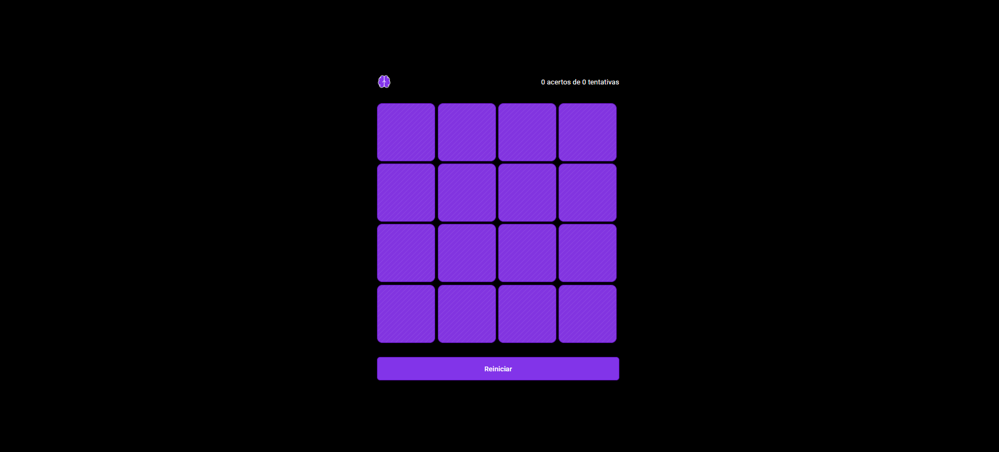
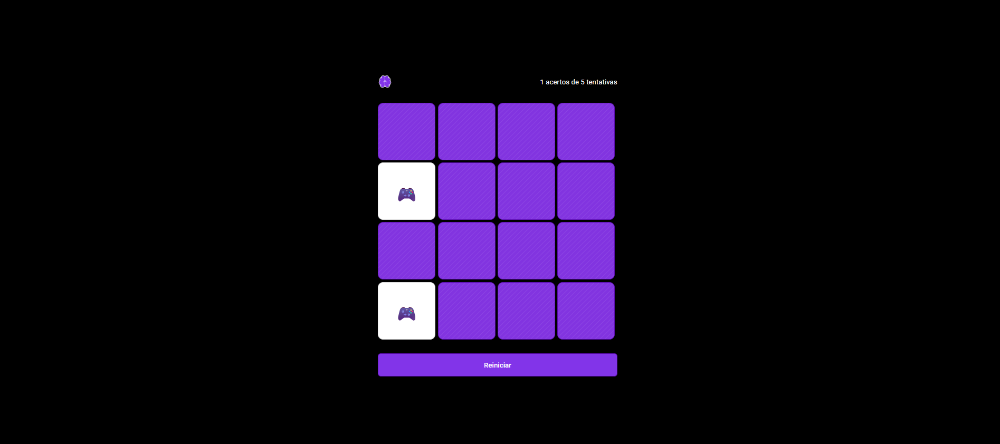
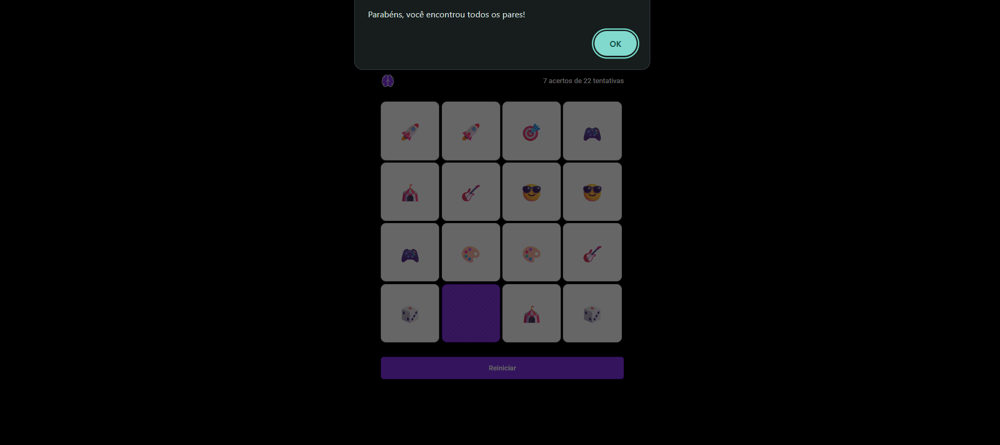

# 🧠 Memory Game (Jogo da Memória)

Implementação de um jogo da memória utilizando JavaScript puro, com foco em manipulação do DOM, controle de estado e lógica de interação.

Projeto desenvolvido como atividade prática acadêmica.

---

## Preview

---

## Funcionalidades

- Embaralhamento aleatório das cartas
- Sistema de clique para revelar cartas
- Validação de pares
- Contador de tentativas
- Contador de acertos
- Bloqueio de interação durante verificação
- Reset do jogo
- Feedback visual via CSS

---

## Stack

- HTML
- CSS
- JavaScript

---

## Arquitetura e Lógica

O estado da aplicação é controlado por variáveis globais:

- `flippedCards`: armazena as cartas atualmente viradas
- `matchedPairs`: quantidade de pares encontrados
- `attempts`: número de tentativas realizadas
- `isCheckingPair`: controla bloqueio de interação

### Fluxo do jogo

1. O usuário clica em uma carta
2. A carta é revelada (`.revealed`)
3. Ao virar duas cartas:
   - Se forem iguais → permanecem abertas
   - Se forem diferentes → são ocultadas após 1 segundo
4. O placar é atualizado dinamicamente
5. O jogo finaliza quando todos os pares são encontrados

---

## Estrutura
📁 projeto
├── index.html
├── styles.css
├── scripts.js
└── assets/

---

## Como executar
git clone https://github.com/
cd 
Abra o arquivo index.html no navegador.

---

### Possíveis Melhorias 
Animação ao virar cartas
Responsividade (mobile)
Timer de jogo
Sistema de pontuação
Níveis de dificuldade
Persistência de ranking

---

### Observações
Projeto desenvolvido sem uso de frameworks para reforço de fundamentos de JavaScript e manipulação direta do DOM.
